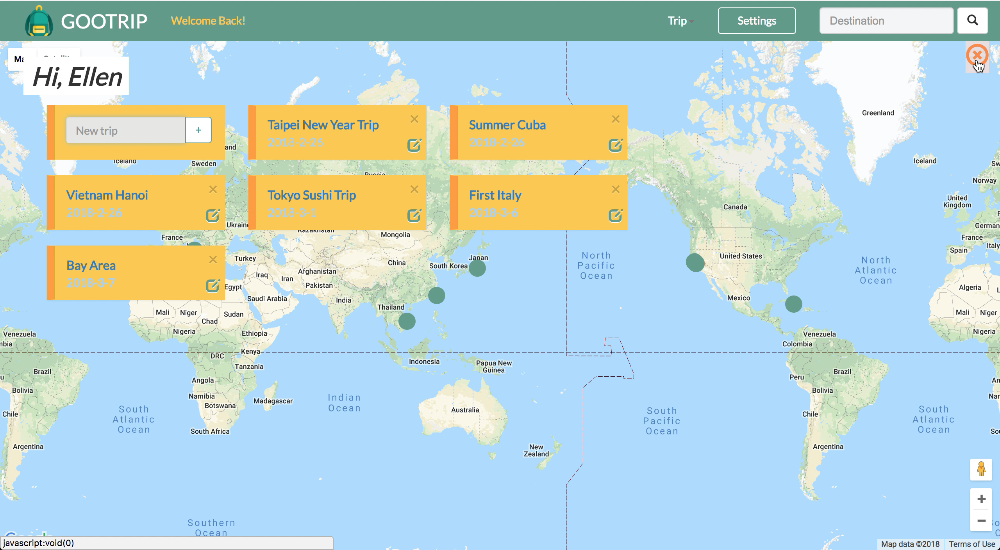
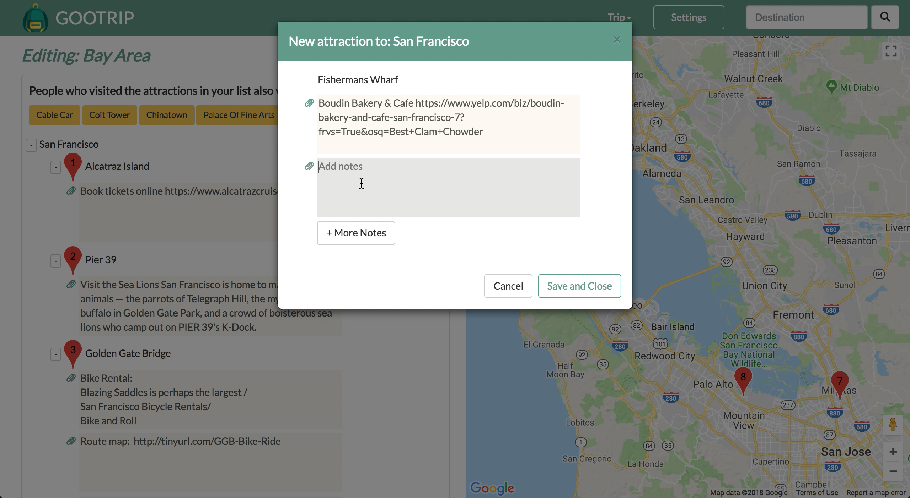

## GooTrip

Environment: python 2.7

#### Hackbright Individual Project

- Technology Stack:
Python, JavaScript, HTML, CSS, Flask, Jinja, React, jQuery, PostgreSQL, SQLAlchemy, Bootstrap, passlib

- APIs Used:
Google Place API, MediaWiki (Wikipedia API), Flickr API

- Description: GooTrip helps you create your own travel guides with personal travel memos –restaurants, activities, personal notes – anything you would love to keep up with your travels. With GooTrip users can enter the places they would like to visit and attractions within that location. They can then also make personal notes on each attraction. The result is a great, interactive guide with all the places to visit, details about each attraction, a Google map to show where the attractions are located, and photos for each attraction. GooTrip is designed to easily add/update/delete travel details, and uses a machine learning algorithm to provide recommended attractions based on your list and locations others have visited.


<p align="center"></p>

#### Login page


#### Dashboard


#### Edit trip content


#### Using Google Place API, MediaWiki (Wikipedia API), Flickr API


#### Run GooTrip locally

1. Clone this repository
```python
cd gootrip
```

2. Create an virtual environment
```python
virtualenv env 
source env/bin/activate
```

3. Install required packages
```python
pip install -r requirements.txt
```

4. Get Flicker API and write in secrets.sh

```
export FLICKR_API_KEY='your_API_key'
export FLICKR_API_SECRET='your_API_secret_key'
```

```python
source secrets.sh
```


5. Create database and initialize the tables
```python
createdb gooplanner
python model.py
```

6. Run the server
```python
python server.py
```


